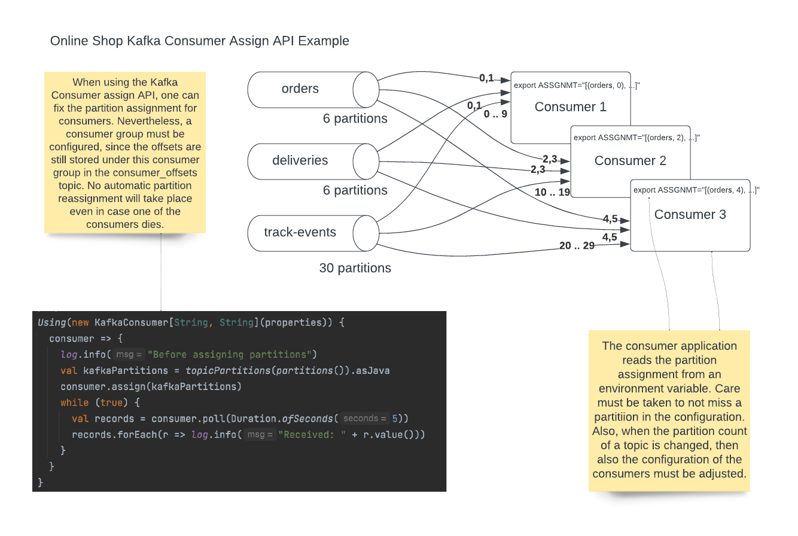

## Kafka Consumer Manual Partition Assignment Example

In most cases, Kafka consumer applications make use of consumer groups, automatic
partition assignment and rebalancing to achieve horizontal scalability and high availability. 
This allows one instance of a consumer group to take over the work of another instance of the same consumer group in case that instance fails. 
It also allows to scale up or down instances in case the current number of instances is 
less than or more than needed. 
Finally, it allows to automatically react to a changing number of partitions of a topic. 

However, in some cases automatic partition assignment using consumer groups does not 
give enough control over the consumer application. 
This may be the case when the throughput over different partitions or different topics varies, and one wishes to group partitions with high throughput together with parittions of lower throughput, such that sum of throughput over the assigned partitions of a consumer instance is even across consumer instances. 

This can be achieved using manual partition assignment using the Kafka consumer assign API. This repository shows an example of how to do this using Scala. Since the Scala code is using the Kafka Java client libraries, this can be done in a very simlar fashion also with Java. 

The following diagram gives an overview over the demo:

